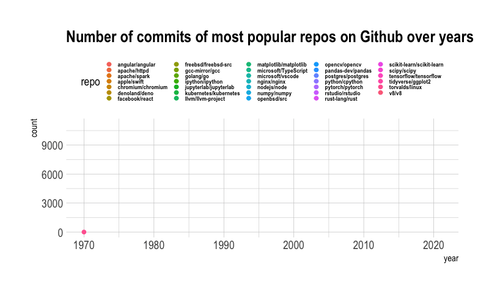
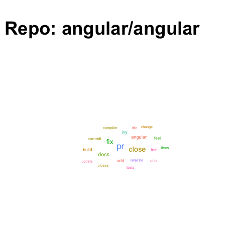

```{r setup, message=FALSE,echo = FALSE, warning=FALSE}
library(data.table)
library(tidyverse)
library(dplyr)
library(plotly)
library(DT)
library(knitr)
# Initialize code chunk options
opts_chunk$set(
  warning = FALSE,
  message = FALSE,
  eval=TRUE,
  echo = TRUE,
  cache = FALSE,
  fig.width = 7, 
  fig.align = 'center',
  fig.asp = 0.618,
  out.width = "700px",
  class.source = "code-r")
```

# Showcasing some animated plots

### Animated Number of commits
```{r echo=FALSE}

```

### Animated wordclouds of different repos
```{r echo=FALSE}

```

